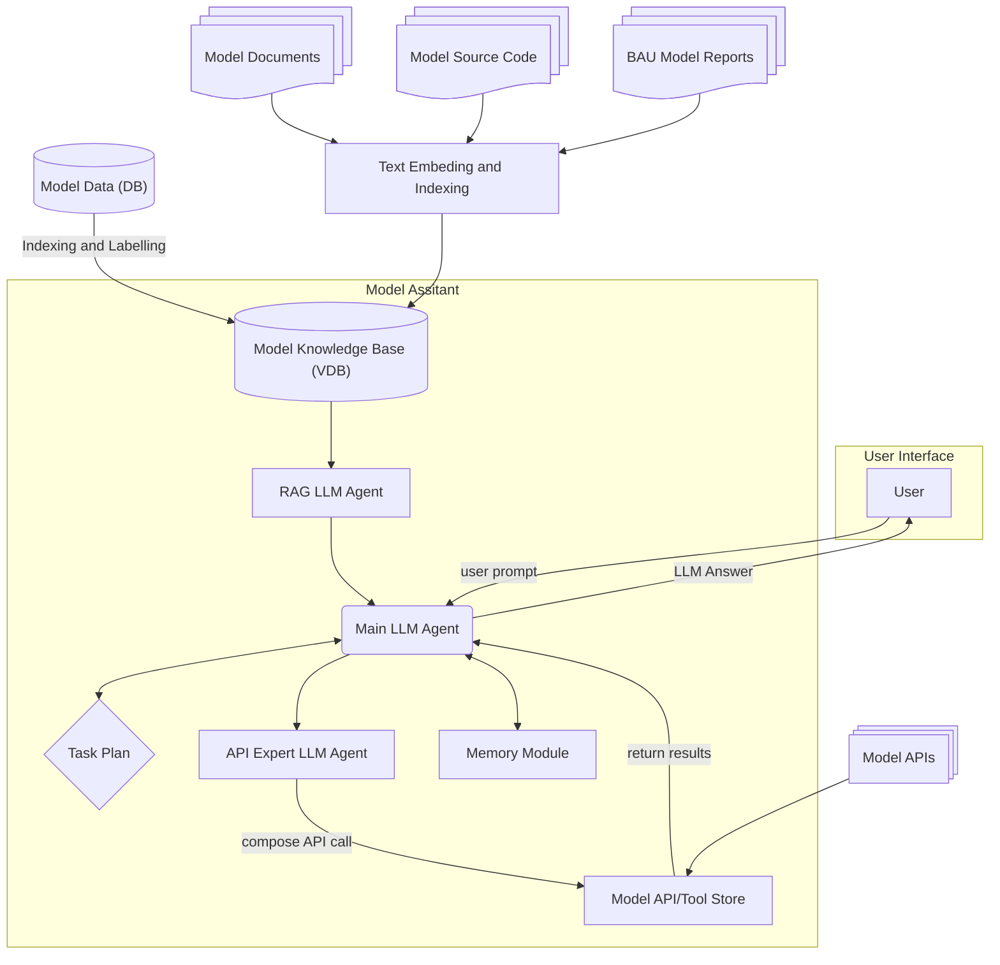

## Initial Design

```mermaid
flowchart TD

    subgraph User Interface
        A[User] 
    end

    
    subgraph Model Assitant
        A -->|user prompt| B(Main LLM Agent)
        B -->|LLM Answer| A


        B <--> C{Task Plan}

        B --> I[API Expert LLM Agent] --> |compose API call| D[Model API/Tool Store] --> |return results| B
        
        E@{shape: cyl, label: "Model Knowledge Base (VDB)"} -->H[RAG LLM Agent]  --> B
        
        B <-->G[Memory Module]


    end
    F@{shape: cyl, label: "Model Data (DB)"} --> |Indexing and Labelling| E

    N@{ shape: procs, label: "Model APIs"} --> D

    J@{ shape: docs, label: "Model Documents" } --> L[Text Embeding and Indexing] --> E
    K@{ shape: docs, label: "Model Source Code" } --> L
    M@{ shape: docs, label: "BAU Model Reports" } --> L    
```

